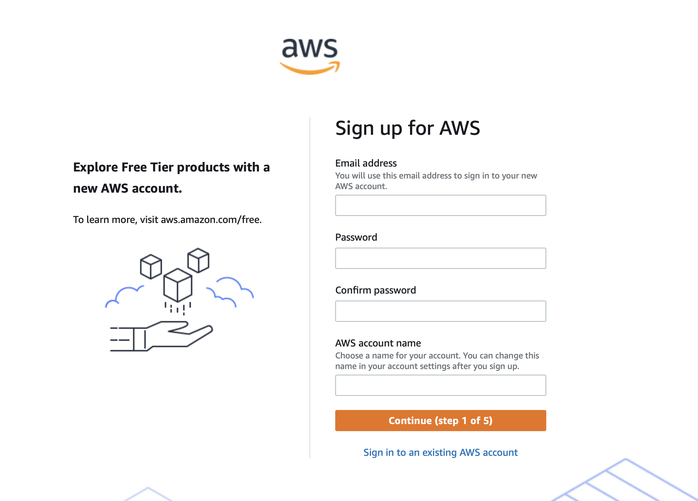
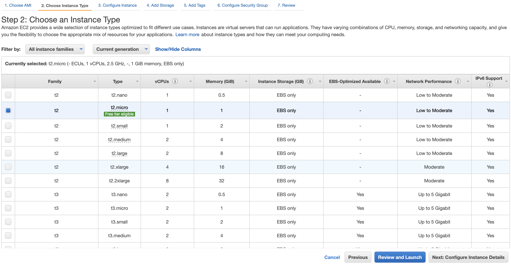

[Back to NSRR Cloud](./index.md)

# Getting started with AWS Cloud

## Sign-up process

Visit [AWS Sign up](https://portal.aws.amazon.com/billing/signup#/start){:target="_blank"} webpage to get started with AWS sign-up process 

### Step 1:
In step-1 page, Email Address for AWS account sign up, it is recommended to use email address that you are going to have access for long enough till the AWS account will be used/deactivated. If you lose access to your email, there are couple of situations that can come up, like,
- If any AWS services are still running then you will be receiving bills to your credit card; indirectly it will make it harder to delete the AWS account
- If you are performing any important activity like hosting a website or unsaved analytical work in AWS account, there is a good probability that it will be harder to recover, restore etc.

'AWS account name' is name that you can see after logging in AWS account (after successful sign up)




### Step 2:
Enter contact information and click Continue


### Step 3:
Enter billing information and click Continue


### Step 4:
Select your identification method and complete the verification of the identity


### Step 5:
Select a support plan per your needs. Recommended to start with basic support and later if any advanced support is needed, plan can be upgraded. 
Click Complete sign up process


Now you should've successfully signed up for AWS account.

## AWS Login

To log in to the AWS account visit [AWS portal](https://console.aws.amazon.com){:target="_blank"}. Choose the option to login with root email and enter login credentials used during sign up process

Once you have successfully signed in, you will be redirected to AWS home page. 


 
 
## Start EC2 instance

EC2 stands for Elastic Compute Cloud, is an AWS service providing compute resources. To start a new EC2 instance, type 'EC2' in the top search bar in home page of your AWS account.


Select 'EC2' under services from search results. You will be now redirected to the dashboard page of the EC2 service.


### Step 1:

Click on Launch Instance in the dashboard page of EC2 and search 'ubuntu'

Click Select on option 'Ubuntu Server 20.04 LTS (HVM), SSD Volume Type'


### Step 2:

In this page, you can see various types of EC2 instance configurations. Select the instance that works for your use case. 

**Reminder** compute costs vary by instance type. Visit [EC2 pricing](https://aws.amazon.com/ec2/pricing/on-demand/){:target="_blank"} webpage to learn more.

The default selected is t2.micro instance which is free tier eligible, we recommend new users to continue with default instance to help them get comfortable before choosing more powerful EC2 instances.

Note: t2.micro instance may not be powerful enough for running Sleep Analysis tools. 

After the instance is selected, Click on Configure Instance Details.




### Step 3:

In this page, default configuration can stay as it is. Click on Add Storage.


### Step 4:

Enter the size of the storage, 20 GB should be optimal for downloading and processing of NSRR datasets by subject. Increasing the Storage after EC2 instance setup is possible but may require more technical knowledge.

 Click on Add Tags.


### Step 5:

You don't have to add tags unless you are planning to use multiple servers in this AWS account to help you with identifying and tracking inventory. Click on next Configure Security Group.

### Step 6:

Default security groups configuration should work in most use cases. If you are advanced user who can identify the IP address(es) of your access location(s) then you can update default rule of port 22's source from 0.0.0.0/0 to your IP's. Click on Review and Launch, then Click on Launch.

In the final step, you will be asked to create new a key pair (if there is none previously setup). 

Enter Key pair name (example) and let the default Key pair type as RSA. Now Click on Download Key Pair. The downloaded key would be example.pem

In your local, change the permissions of the downloaded Key Pair PEM file to 700,

```
chmod 700 example.pem 
```
And make sure to keep a copy of this PEM file safe for recovery from accidental deletion. In case the PEM file is lost, there is no other way of logging in to the EC2 instance(s) created using the PEM file.


Now click on Launch Instances. You should see message for successful launch of EC2 instance. Click on View Instances.


You will be redirected to the EC2 dashboard page. Here you can see the newly created EC2 instance listed,


## EC2 instance login

In general, it will take about a minute or two for the EC2 instance to be up and running after successful launch.

To login to your newly created EC2 instance, go to the EC2 dashboard page and select Instances from the Left side bar.

Select on the newly created instance ID and copy the 'Public IPv4 address'. This is the IP address that we are going to use to SSH into the EC2 instance.


Run below command to SSH into the EC2 instance,

```
ssh -i example.pem ubuntu@copied.ipv4.address
```

Upon successful ssh,


You have now successfully completed launching and logging into the EC2 instance