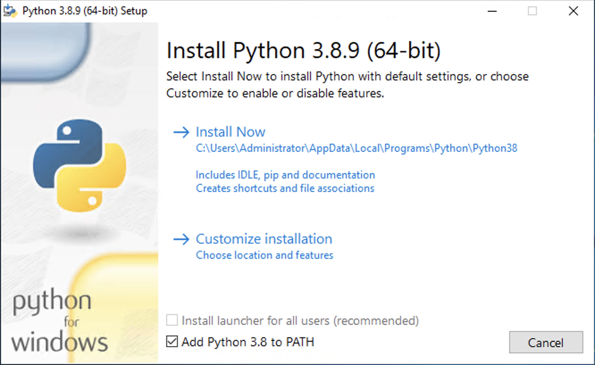
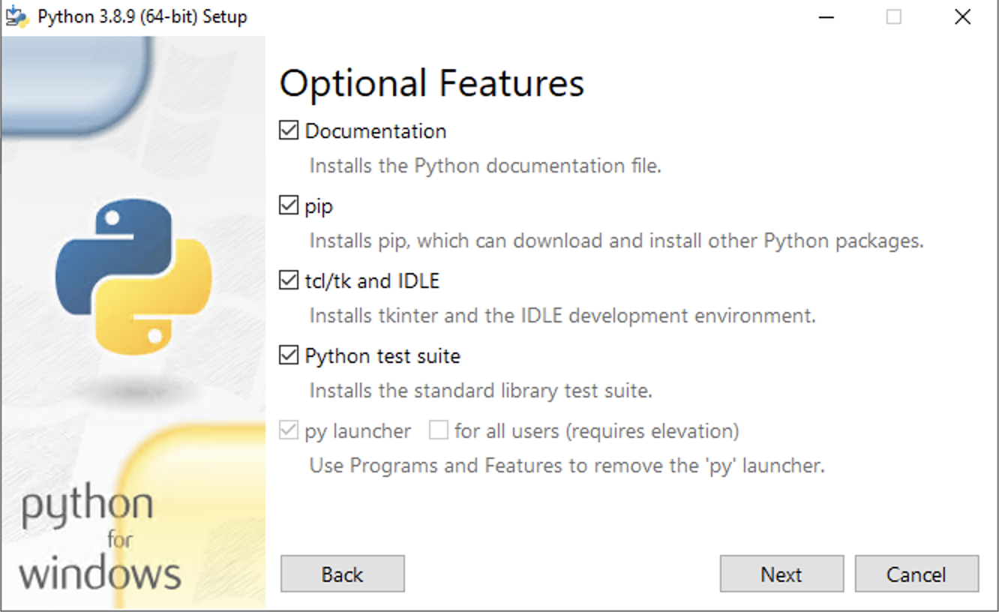
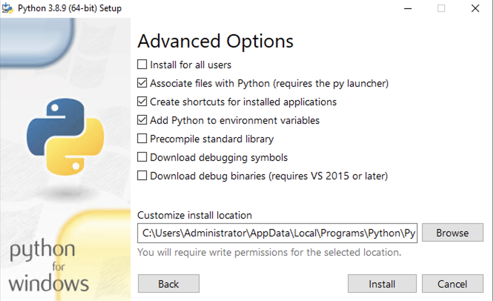
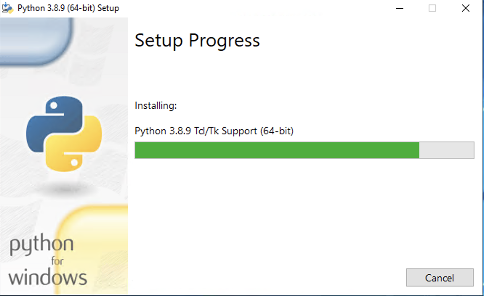
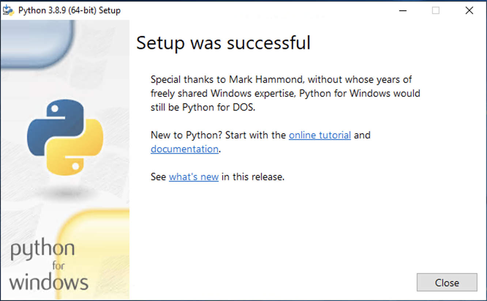

[Back to NSRR Cloud](./index.md)

[Install python3.8 in Windows](#install-python38-in-windows)

[Install python3.9 in mac](#install-python398-in-mac)

[Install python3.9 in Linux](#install-python39-in-linux)


# Install python3.8 in Windows

It is highly recommended to use Python 3.8.x version only in Windows. To install python3.8, visit [Python for Windows download](https://www.python.org/downloads/windows/){:target="_blank"} webpage and download Windows installer (32 or 64 bit) for version python3.8.9

Double click on the downloaded installer and begin the installation process.



Select customize installation and then choose option 'pip' in Optional Features page. Click Next 




In Advanced Options page, choose option 'Add Python to environment variables'. Click on install.



Setup progress will be indicated in the installer,




Finally installation success message will show up on successful installation




After the installation is completed, Open Powershell and run the below command to verify python is installed and added to path,

```
python
python -m pip
```

In case there are multiple versions of python installed then the system will allow you to run specific python version using,

```
py 3.8
py -3.8 -m pip
```


# Install python3.9.8 in Mac

Since Mac systems are now available with two different Chip options - Intel and Apple Silicon, Python has upgraded their installer to be universal i.e., supporting both chip options. In accordance with that, we recommend using Python version 3.9.8 or above in Mac. 

```
brew install python@3.9 
```

Above command will install latest stable version of Python 3.9. Run below command to check if python is successfully installed and added to the path, 

```
python3
python3 -m pip
```

To manage multiple versions of python in Mac, we recommend using virtual environment. To learn more on virtual environment, visit [Python Virtual Envs](https://docs.python-guide.org/dev/virtualenvs/){:target="_blank"}


## Install python3.9 in Linux

If you are using Ubuntu 16.10 or newer, then you can easily install Python 3.9 with the following commands

```
sudo apt update
sudo apt install python3.9
sudo apt install python3-pip
```

Run below command to check if python is successfully installed, 

```
python3
python3 -m pip
```

Note: In the example workflow described in this website, we will be using Ubuntu 20.x. 
